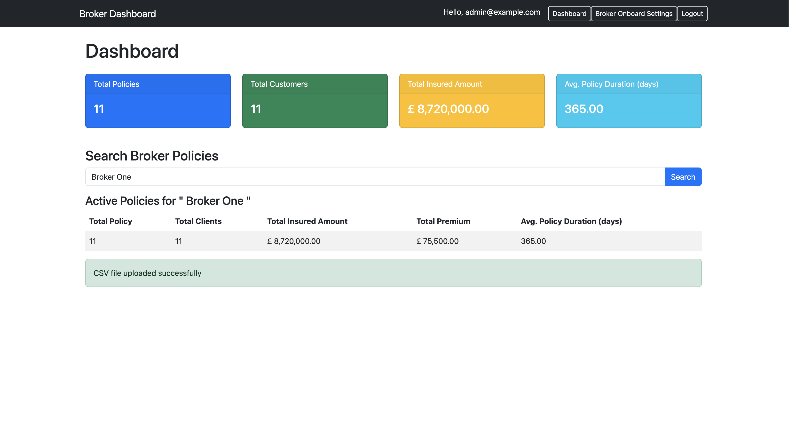

# 🚀 Broker Data Ingestion & Aggregation System

This project is a multi-tenant **broker data ingestion & analytics system** built with **Symfony 7**, **MariaDB**, **Redis**, and **Docker**. It supports **JWT security**, **multi-source policy imports**, and **Background CLI data procesing updates**. It include A Postman API documentation and Collection which is published and available for testing at (https://documenter.getpostman.com/view/11654343/2sAYXCiyAr).

## **🔹 Features**

✔️ Multi-Tenant Broker Management  
✔️ Configurable CSV Policy Import (Auto-Mapping)  
✔️ Data Aggregation & Reporting (Total Policies, Customers, Premiums, etc.)  
✔️ Redis Caching for Performance Boost  
✔️ JWT-Based Authentication  
✔️ Background CLI Job Processing  
✔️ Dockerized for Easy Deployment




---

## **📌 System Requirements**

Ensure you have the following installed before setup:

- **Docker** (Latest Version) → [Install Docker](https://docs.docker.com/get-docker/)
- **Docker Compose** (Latest Version) → [Install Docker Compose](https://docs.docker.com/compose/install/)
- **GNU Bash** (`setup.sh` requires Bash) → Install via Homebrew (Mac) or `apt/yum` (Linux)

---

To see the app working you will need to provide it with an SSL certificate. To do this please install 'mkcert' onto your computer.

To install mkcert on your system, follow the instructions specific to your operating system:

- **macOS: If you're using macOS, you can install mkcert using Homebrew:**

```
brew install mkcert
brew install nss # If you use Firefox
```

- **Linux: For Linux systems, first ensure that certutil is installed:**

```
# For Debian-based systems
sudo apt install libnss3-tools

# For Red Hat-based systems
sudo yum install nss-tools

# For Arch Linux
sudo pacman -S nss

# For openSUSE
sudo zypper install mozilla-nss-tools
```

Then, install mkcert using Homebrew:

```
brew install mkcert
```

Alternatively, you can download the pre-built binary:

```
curl -JLO "https://dl.filippo.io/mkcert/latest?for=linux/amd64"
chmod +x mkcert-v*-linux-amd64
sudo cp mkcert-v*-linux-amd64 /usr/local/bin/mkcert
```

- **Windows: On Windows, you can install mkcert using Chocolatey:**

```
choco install mkcert
```

## **🚀 Setup Guide**

**1️⃣ Clone the Repository and build the services locally on your computer by running (NOTE: this may take several minutes to complete)**

```sh
git clone https://github.com/ahmedlasisi/csv-data-ingest.git
cd csv-data-ingest
docker compose build
```

**2️⃣ Run the Setup Script**

```sh
chmod +x setup.sh
./setup.sh
```

If using Visual Studio Code and you see message like “Visual Studio Code” would like to access data from other apps. Click allow.

✨ What This Script Does

✔️ Creates & starts Docker containers

✔️ Creates the certificate and key file for https://broker.test on your computer and create an entry in your host file so you can reach the app by this domain name

✔️ Waits for MariaDB to be ready

✔️ Runs database migrations

✔️ Generates JWT keys

✔️ Clears & warms up cache

**3️⃣ Access the Application**

App Admin Dashboard: https://phpmyadmin.broker.test

API BaseEndpoint: https://phpmyadmin.broker.test/api/

Database (PhpMyAdmin - Optional): https://phpmyadmin.broker.test

**4️⃣ Login Credentials to App Admin Dashboard**

Admin Role

Username: admin@example.com

Password: Admin123

---

**Import and Ingest Policies**

Policies are imported from CSV files based on broker configurations through the command line interface(CLI)

```sh
docker compose exec broker_app php bin/console app:import-policies

```

or

```sh
Symfony console app:import-policies

```

Expected Behavior:

- Reads CSV files from /var/data/ directory.
- Parse the data from each source and transform it into a common data structure that can be easily processed and analysed.
- Standardise fields irrespective of csv header
- Handle differences in data structure across different formats.
- Imports policies, clients, and financials into the system.

**1️⃣ Default CSV Files for Testing**

By default, two test CSV files are preloaded in the system and located at:

- /var/data/broker1.csv
- /var/data/broker2.csv

📌 Usage: Modify or replace these files with new data, maintaining the same format. This will not affect already ingested data

**2️⃣ How to Add a New Broker & Import Policies**

- Step 1: Add a New Broker and configuration detail via API or UI

- Step 2: Prepare a CSV file with the policies for the new broker

- Step 3: Place files with data to be ingested with same registed file name for each broker. This can be improved in future to handle and keep old data for broker

- Step 4: Upload CSV asynchronously for each broker in UI or Run the import policy command in the CLI

- Step 5: Verify data in the Backend Admin Dashboard or API

**📜 API Endpoints**

To make API testing easier:

For API testing, use the provided Postman API Collection. The API documentation and Collection is published at (https://documenter.getpostman.com/view/11654343/2sAYXCiyAr)

🛠️ API Endpoints & Features

🔑 Authentication

- POST /api/login - Authenticate & Get JWT Token
- POST /api/register - User Registration

📦 Broker/Tenant Onboarding

- POST /api/brokers/config/new - Create broker config
- GET /api/brokers/config/list - List broker config
- PUT /api/brokers/config/{uuid} - Update broker config
- DELETE /api/brokers/config/delete/{uuid} - Delete broker config

📥 Broker/Tenant Data Management

- POST /api/brokers/config/upload/{uuid} - Upload CSV for broker
- DELETE /api/brokers/{uuid}/clear-policies - Clear broker policies only
- DELETE /api/brokers/{uuid}/clear-all - Delete broker & all data

📊 Aggregation & Reporting

- GET /api/aggregation/summary - Aggregated summary
- GET /api/aggregation/by-broker - Grouped by brokers
- GET /api/aggregation/by-broker/{uuid} - Single broker aggregation

**⚡ Performance Optimization**

## ✅ Redis Caching

Enabled for aggregated data queries. Automatically clears when broker configurations change.

**✅ Dockerized PHPMyAdmin**

Access your database easily via PhpMyAdmin at https://phpmyadmin.broker.test.
Check the .env file for root user password - DB_ROOT_PASSWORD values.

Login Credentials:

Server: broker_mariadb

User: root

Password: $DB_ROOT_PASSWORD

**Testing Framework**

The tests cover various aspects of the service, including CSV file processing, entity creation, and logging. The tests are written using PHPUnit, a popular testing framework for PHP. PHPUnit is used to test that the core functionalities, database interactions, and services work as expected.

To run tests:

```sh
php bin/phpunit
```

For a detailed test output:

```sh
 php bin/phpunit --testdox --debug
```

To stop and remove all the services and docker setup

```sh
chmod +x cleanup.sh
./cleanup.sh
```
