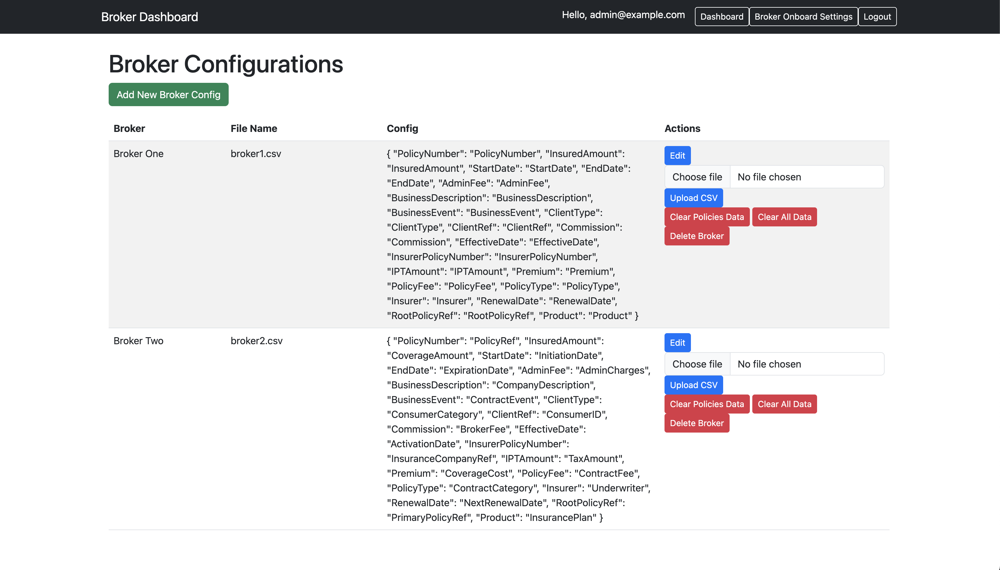

# 🚀 Broker Data Ingestion & Aggregation System

This project is a multi-tenant **broker data ingestion & analytics system** built with **Symfony 7**, **MariaDB**, **Redis**, and **Docker**. It supports **JWT security**, **multi-source policy imports**, and **real-time WebSockets updates**.

## **🔹 Features**

✔️ Multi-Tenant Broker Management  
✔️ Configurable CSV Policy Import (Auto-Mapping)  
✔️ Data Aggregation & Reporting (Total Policies, Customers, Premiums, etc.)  
✔️ Redis Caching for Performance Boost  
✔️ JWT-Based Authentication  
✔️ Background CLI Job Processing  
✔️ Dockerized for Easy Deployment




---

## **📌 System Requirements**

Before running the setup, ensure you have:

- **Docker** (Latest Version) → [Install Docker](https://docs.docker.com/get-docker/)
- **Docker Compose** (Latest Version) → [Install Docker Compose](https://docs.docker.com/compose/install/)
- **GNU Bash** (`setup-demo.sh` requires Bash) → Install via Homebrew (Mac) or `apt/yum` (Linux)

---

## **🚀 Quick Start (One-Step Setup)**

**1️⃣ Clone the Repository**

```sh
git clone github.com/ahmedlasisi/csv-data-ingest.git
cd csv-data-ingest
```

**2️⃣ Run the Setup Script**

```sh
chmod +x setup-demo.sh
./setup-demo.sh
```

✨ What This Script Does

✔️ Creates & starts Docker containers
✔️ Waits for MariaDB to be ready
✔️ Runs database migrations
✔️ Seeds demo data (Test Brokers & Configs)
✔️ Generates JWT keys
✔️ Clears & warms up cache
✔️ Restarts all services

**3️⃣ Access the Application**

Backend Admin: http://127.0.0.1:8000
API BaseEndpoint: http://127.0.0.1:8000/api/
Database (PhpMyAdmin - Optional): http://127.0.0.1:8080

**4️⃣ Login Credentials to Backend Admin**

Admin Role
Username: admin@example.com
Password: Admin123

⚙️ Configuration
🛠️ Environment Variables
The system reads configuration from .env.docker. The setup-demo.sh ensures all required variables are set.

To customize, edit .env.docker:

**Command Line tool: Import and Ingest Policies**
Imports policies from CSV files based on broker configurations.
This process reads data from CSV files, validates it, and stores it in the database after server and DB has been provisioned and is ready for use.

```sh
docker compose exec broker_app php bin/console app:import-policies

```

or

```sh
Symfony console app:import-policies

```

Expected Behavior:

- Reads CSV files from /var/data/ directory.
- Parse the data from each source and transform it into a common data structure that can be easily processed and analysed.
- Standardise fields irrespective of csv header
- Handle differences in data structure across different formats.
- Imports policies, clients, and financials into the system.

**1️⃣ Available CSV Files for Testing**
By default, two test CSV files are preloaded in the system and located at:

📂 Path:
/var/data/broker1.csv
/var/data/broker2.csv

📌 Usage: These files contain sample policy data for Broker One and Broker Two.
You can modify these files or replace with new ones with fresh data following the same format. This will not affect already ingested data

2️⃣ How to Add a New Broker & Import Policies
To import policies for a new broker, follow these steps:

🔹 Step 1: Add a New Broker and configuration detail via API or UI
🔹 Step 2: Prepare a CSV file with the policies for the new broker
🔹 Step 3: Place files with data to be ingested with same registed file name for each broker. This can be improved in future to handle and keep old data for broker
🔹 Step 4: Run the import policy command in the CLI
🔹 Step 5: Check imported date in the Backend Admin Dashbord or throught the API end point

All this steps can be scaled up, enhanced and fully automated for better data handling in future

**📜 API Endpoints**

To make API testing easier:

A Postman API Documentation and collection is provided. The API documentation and Collection is published at (https://documenter.getpostman.com/view/11654343/2sAYXCiyAr)

The API collection includes:

- User Authentication (JWT)
- Broker & Configuration Management
- Policy Data Retrieval & Aggregation Reports
- Policy Import via File Upload

POST /api/login Authenticate & Get JWT Token
GET /api/brokers/config List all broker configurations
POST /api/brokers/config Create broker config
PUT /api/brokers/config/{uuid} Update broker config
DELETE /api/brokers/config/{uuid} Delete broker config
POST /api/brokers/{uuid}/import Upload CSV & Import Data
DELETE /api/brokers/{uuid}/clear Clear broker policies data

**⚡ Performance Optimization**
✅ Redis Caching
Enabled for aggregated data queries.
Clears automatically when broker configs change.

**✅ Dockerized PHPMyAdmin**
To view database data, PhpMyAdmin is included:

Access at http://127.0.0.1:8080
If required checked the .env file for the generate values for DB_USER and DB_PASSWORD for use

Login using:
Server: broker_mariadb
User: $DB_USER
Password: $DB_PASSWORD

**Testing Framework**
PHPUnit is used to verify that the core functionalities, database interactions, and services work as expected.

Run the PHPUnit Tests
To execute all tests covered:

```sh
php bin/phpunit
```

or for a more detail list

```sh
 php bin/phpunit --testdox --debug
```
